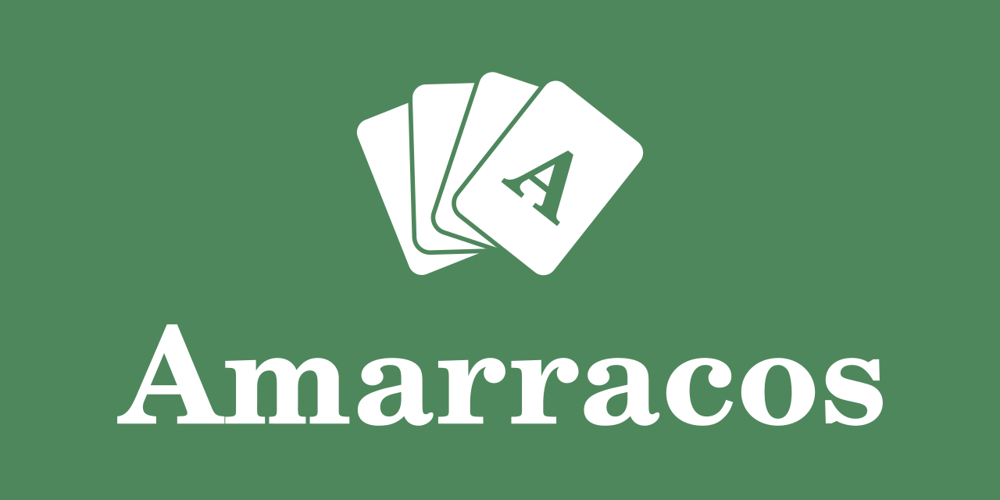

# Amarracos

Amarracos es una aplicación completamente gratis y sin anuncios pensada para jugar cómodamente al [mus](https://www.nhfournier.es/como-jugar/mus/) (y a la [pocha](https://www.nhfournier.es/como-jugar/pocha/)).
Permite contar de manera sencilla los puntos en estos dos juegos de cartas, sin necesidad de usar amarracos físicos o un papel para anotar las puntuaciones.

## Agradecimientos

Este proyecto ha sido posible gracias a la colaboración de [dc138](https://github.com/dc138) y [silimotion](https://github.com/silimotion).

Amarracos forma parte de los proyectos realizados por la asociación [LIMA-UAM](https://github.com/LIMA-UAM).

## Licencia

El código (salvo los archivos `Marker.kt` y `Chart.kt`) está bajo la licencia MIT.  
Copyright (c) 2024-2025 Rodrigo Alcántara.

`app/src/main/java/com/rodalc/amarracos/ui/overview/Chart.kt`  
`app/src/main/java/com/rodalc/amarracos/ui/overview/Marker.kt`  
Están bajo la licencia Apache 2.0. (https://github.com/patrykandpatrick/vico).  
Copyright 2025 by Patryk Goworowski and Patrick Michalik.

Las modificaciones realizadas se pueden ver al inicio de cada archivo.

---

Google Play es una marca de Google LLC.
